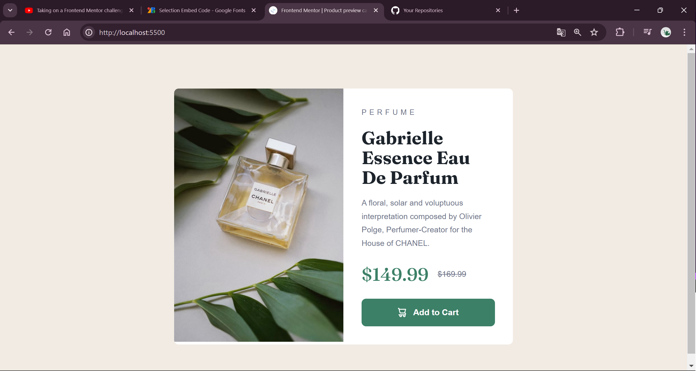
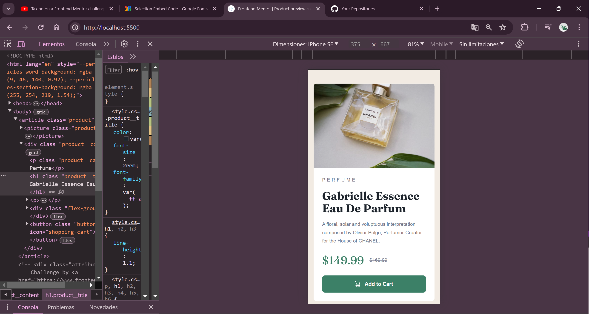

# Frontend Mentor - Product preview card component solution

This is a solution to the [Product preview card component challenge on Frontend Mentor](https://www.frontendmentor.io/challenges/product-preview-card-component-GO7UmttRfa). Frontend Mentor challenges help you improve your coding skills by building realistic projects. 

## Table of contents

- [Overview](#overview)
  - [The challenge](#the-challenge)
  - [Screenshot](#screenshot)
  - [Links](#links)
- [My process](#my-process)
  - [Built with](#built-with)
  - [What I learned](#what-i-learned)
  - [Continued development](#continued-development)
  - [Useful resources](#useful-resources)
- [Author](#author)
- [Acknowledgments](#acknowledgments)

**Note: Delete this note and update the table of contents based on what sections you keep.**

## Overview

### The challenge

Users should be able to:

- View the optimal layout depending on their device's screen size
- See hover and focus states for interactive elements

### Screenshot





### Links

- Solution URL: [Add solution URL here](https://github.com/monica-tech75/perfume-card)
- Live Site URL: [Add live site URL here](https://your-live-site-url.com)

## My process

### Built with

- Semantic HTML5 markup
- CSS custom properties
- Flexbox
- CSS Grid
- Mobile-first workflow


### What I learned

In this project I learn how to render two different images depending in the size of the screen with srcset.
Also how to add elementes that only gonna be render for screen readers.


```html
<h1>Some HTML code I'm proud of</h1>
<picture class="product__images">
      <source srcset="./images/image-product-desktop.jpg" media="(min-width: 600px)">
      
    </picture>
```
```css
.button[data-icon="shopping-cart"]::before {
  content: "";
  background-image: url("./images/icon-cart.svg");
  width: 15px;
  height: 16px;

}
```


### Continued development

Still learning to create my own variables and how to use them

### Useful resources

- [ Resource 1](https://www.joshwcomeau.com/css/custom-css-reset/) - This helped me to make a nice reset of css default properties. I really liked this pattern and will use it going forward.
- [Example resource 2](https://www.example.com) - This is an amazing article which helped me finally understand XYZ. I'd recommend it to anyone still learning this concept.

**Note: Delete this note and replace the list above with resources that helped you during the challenge. These could come in handy for anyone viewing your solution or for yourself when you look back on this project in the future.**

## Author

- Website - [Monica Pardo](https://github.com/monica-tech75)
- Frontend Mentor - [@monica-tech75](https://www.frontendmentor.io/profile/monica-tech75)


## Acknowledgments

Thanks to [@KevinPowell] (https://www.kevinpowell.co/newsletter)for his love for CSS and the super guides and videos he make.
I do this projecy following a video with him, then is not really my work but I hope next time I can apply many things I learn from this project.
